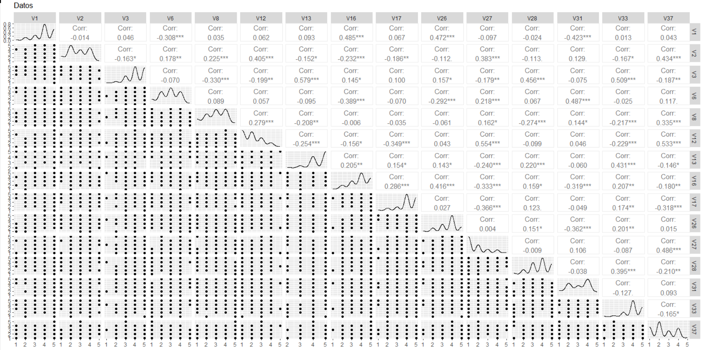
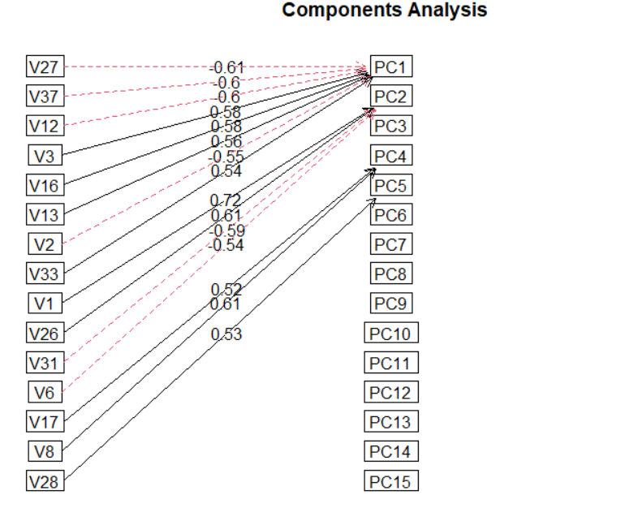
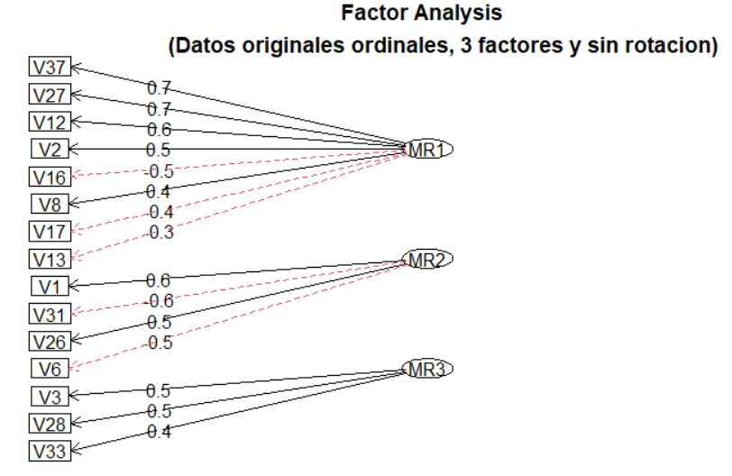

# PersonalityAnalysisStudents
This repo analyzes a dataset of 228 students' personality traits using Principal Component Analysis (PCA) and Exploratory Factor Analysis (EFA). The goal is to uncover patterns and summarize the data for better understanding and improvement of student engagement.

## Componentes principales y análisis factorial exploratorio para el análisis de la personalidad en estudiantes

Para las universidades, es importante conocer la personalidad de sus estudiantes, ya que esto permite desarrollar y aplicar estrategias para mejorar el rendimiento académico, la integración y participación de los estudiantes, el desarrollo profesional y, sobre todo, el bienestar y la salud mental. En resumen, se busca crear un entorno donde los estudiantes puedan desarrollarse de forma efectiva e inclusiva tanto académica como personalmente.

En este trabajo se realizará un análisis a la base de datos "Dat3Ex.csv” que correspondía a una encuesta sobre la personalidad de un grupo de 228 alumnos de licenciatura de una universidad de Estados Unidos. Se llevará a cabo un análisis de componentes principales y un análisis factorial exploratorio, con el objetivo de encontrar patrones interesantes que nos ayuden a resumir los datos.

Las variables de interés de la encuesta son: V1: "Es hablador", V2: "Tiende a encontrar fallas en los demás", V3: "Hace un trabajo minucioso", V6: "Es reservado", V8: "Puede ser algo descuidado", V12: "Empieza peleas con otros", V13: "Es un trabajador confiable", V16: "Genera mucho entusiasmo", V17: "Perdona fácilmente", V26: "Tiene una personalidad asertiva", V27: "Puede ser frío y distante", V28: "Persevera hasta el final", V31: "Es tímido e inhibido a veces", V33: "Hace cosas eficientemente", V37: "Es rudo con otros". Las respuestas van de 1 a 5, donde 1 es "muy en desacuerdo" y 5 es "muy de acuerdo".

Para hacer un buen análisis es importante que la varianza de los datos esté en la misma escala, ya que en caso contrario podría causar problemas o malas interpretaciones.

Como se puede ver en la figura, se observa una fuerte relación entre algunas variables. Por ejemplo, entre V6 y V1, V8 y V2, V12 y V2, V16 y V1, y V13 y V3, entre otras. Además, dado que las respuestas de todas las variables van del 1 al 5, los datos se mantienen en la misma escala, por lo que es intuitivo que las varianzas también estén en la misma escala. De la salida de la función `var(Datos)` del archivo `Ejercicio3.RMD`, podemos ver que, aunque hay diferencias entre las varianzas de los datos, no son tan significativas. La varianza más pequeña es de 0.52, perteneciente a V13: "Es un trabajador confiable", mientras que la más grande es de 1.338, correspondiente a V31: "Eres tímido e inhibido".

Para explorar diferentes dimensiones e interpretaciones de los datos, se trabajó con los datos originales y con los mismos datos pero aplicando dos transformaciones: una estandarización o logaritmo base 10. Además, los datos se analizaron tanto de forma continua como de manera categórica ordinal aplicando rotaciones como la "varimax", aprovechando las capacidades del paquete "psych".

Para seleccionar el mejor modelo, tanto en análisis de componentes como factorial exploratorio, se consideraron los siguientes factores: la capacidad de resumir la varianza de los datos en el menor número de componentes y la claridad en la interpretación de los datos. Cabe destacar que este segundo factor es subjetivo y puede variar según el evaluador. Las correlaciones de interés fueron las mayores a 0.5.

Tras trabajar con todos los modelos, incluyendo transformaciones, rotaciones, etc., tanto en el análisis factorial como en el análisis de componentes principales, la mayoría de las veces las mismas variables se relacionaban con el mismo componente o factor. Esto significaba que obteníamos casi la misma interpretación, lo que le dio más valor a la acumulación de la varianza y a la cantidad de variables que se correlacionaban con un factor o componente principal.

### Análisis de componentes principales

El modelo que mejor representó los datos fue el análisis factorial exploratorio. Sin embargo, veamos cuál fue nuestro resultado con el análisis de componentes. De todas las transformaciones, la estandarización fue la que nos proporcionó la mejor interpretación de los datos para el análisis de componentes, además de resumir de manera prometedora la varianza. Como se ve en la figura, podemos encontrar las siguientes dimensiones interesantes:

- Índice de conducta Constructiva-Destructiva (PC1): Correlaciona negativamente con V27: "Puedes ser frío y distante", V37: "Eres rudo con otros", V12: "Empiezas peleas con otros", y V2: "Tiende a encontrar fallas en los demás". Y positivamente con V3: "Hace un trabajo minucioso", V16: "Generas mucho entusiasmo", V13: "Es un trabajador confiable", y V33: "Haces cosas eficientemente".
- Índice de Extroversión-Introversión (PC2): Correlaciona positivamente con V1: "Es hablador" y V26: "Tienes personalidad asertiva". Y negativamente con V31: "Eres tímido" y V6: "Eres reservado".
- Índice de Indulgencia y Descuido (PC3): Correlaciona positivamente con V17: "Perdonas fácilmente" y V8: "Eres descuidado".

### Análisis factorial exploratorio

Como se mencionó en la sección anterior, de todos los modelos trabajados tanto en análisis de componentes como en análisis factorial exploratorio, el que presentó un mejor desempeño fue el que trató a los datos como categóricos ordinales y no utilizó rotaciones.

Como se ve en la figura, podemos encontrar las siguientes dimensiones interesantes:

- Índice de Agresividad vs. Empatía y Confiabilidad (MR1): Correlaciona positivamente con V37: "Eres rudo con otros", V27: "Puedes ser frío y distante", V12: "Empiezas peleas con otros", V2: "Tiende a encontrar fallas en los demás", V8: "Puede ser algo descuidado". Y correlaciona negativamente con V16: "Generas mucho entusiasmo", V17: "Perdonas fácilmente", V13: "Eres un trabajador confiable".
- Índice de Extroversión-Introversión (MR2): Correlaciona positivamente con V1: "Eres hablador" y V26: "Tienes una personalidad asertiva". Correlaciona negativamente con V31: "Eres tímido" y V6: "Eres reservado".
- Índice de Minuciosidad y Eficiencia (MR3): Correlaciona positivamente con V3: "Hace un trabajo minucioso", V28: "Perseveras hasta el final", V33: "Haces cosas eficientemente".

Este modelo no solo resumió de manera prometedora la varianza de los datos, sino que también ofreció una interpretación clara y útil.
